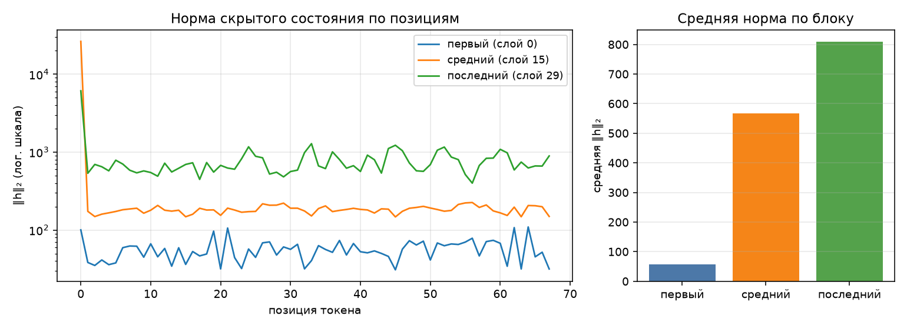

# Анатомия SmolLM2-135M-Instruct

Сгенерировано `make inspect`. dtype `bfloat16`, device `cuda`.

## 1. Конфигурация

| Параметр | Значение |
|---|--:|
| слоёв | 30 |
| hidden_size | 576 |
| intermediate_size | 1536 |
| голов запроса | 9 |
| KV-голов (GQA) | 3 |
| head_dim | 64 |
| словарь | 49 152 |
| tie_word_embeddings | True |

GQA: 9 голов запроса на 3 KV-головы — KV-cache вдвое меньше, чем при обычном multi-head.

## 2. Условия замера

| Условие | Значение |
|---|---|
| платформа | Linux-6.18.33.2-microsoft-standard-WSL2-x86_64-with-glibc2.43 (Linux 6.18.33.2-microsoft-standard-WSL2, x86_64) |
| устройство | `cuda` |
| dtype | `bfloat16` |
| seq_len × batch | 128 × 1 |
| прогонов на режим | 1 |
| память измерена | `torch.cuda.max_memory_allocated` |
| RSS измерена | `ru_maxrss` |
| python | 3.14.4 |
| torch | 2.14.0+cu130 |
| transformers | 5.17.0 |
| peft | 0.20.0 |

Цифры ниже верны только для этих условий. Замер памяти без указания
устройства, dtype, длины последовательности и метрики не воспроизводится
и не сравнивается — поэтому источник метрики стоит отдельной строкой.
Сверьте, что в этой строке названа метрика, уместная для вашего
устройства, и что полученные числа с ней согласуются.

## 3. Параметры по типам модулей

| Группа | Модулей | Shape | Параметров | Доля | Разделяет тензор |
|---|--:|---|--:|--:|--:|
| `embed` | 1 | 49152×576 | 28 311 552 | 21.05% | — |
| `q_proj` | 30 | 576×576 | 9 953 280 | 7.40% | — |
| `k_proj` | 30 | 192×576 | 3 317 760 | 2.47% | — |
| `v_proj` | 30 | 192×576 | 3 317 760 | 2.47% | — |
| `o_proj` | 30 | 576×576 | 9 953 280 | 7.40% | — |
| `gate_proj` | 30 | 1536×576 | 26 542 080 | 19.73% | — |
| `up_proj` | 30 | 1536×576 | 26 542 080 | 19.73% | — |
| `down_proj` | 30 | 576×1536 | 26 542 080 | 19.73% | — |
| `norm` | 61 | 576 | 35 136 | 0.03% | — |
| `lm_head` | 1 | 49152×576 | 0 | 0.00% | 28 311 552 |
| **итого** | | | **134 515 008** | 100% | |

Контроль: `sum(p.numel() for p in model.parameters())` = 134 515 008 — сходится с суммой по таблице.

Обратите внимание на строку `lm_head` и на значение `tie_word_embeddings`
в конфигурации: они связаны, и от этой связи зависит итог таблицы.

## 4. Нормы активаций (forward-hooks)

Промпт: «Объясни, что такое MLOps, в трёх предложениях.», 68 токенов после chat template.

| Блок | Индекс | Средняя ‖h‖₂ | Максимум |
|---|--:|--:|--:|
| первый | 0 | 56.8 | 109.6 |
| средний | 15 | 566.6 | 26263.2 |
| последний | 29 | 808.3 | 6100.6 |

Норма растёт от блока к блоку — прямое следствие residual-связей: блок
добавляет к потоку, а не заменяет его. Максимум на порядок-два выше среднего,
и сидит он на первой позиции: это attention sink, массивная активация,
в которую модель складывает «внимание ни к чему». Поэтому шкала на графике
логарифмическая — в линейной один этот выброс придавил бы всё остальное.

Прогон с хуками должен быть повторяемым: второй вызов в том же процессе
обязан дать те же числа и не оставить следов на модулях.

## 5. Сколько параметров добавляет LoRA

| Конфиг | Целевых модулей | Своя формула | peft | Совпало | % от базовой |
|---|--:|--:|--:|:-:|--:|
| r=8, q_proj+v_proj | 2 типов | 460 800 | 460 800 | да | 0.343% |
| r=16, все линейные | 7 типов | 4 884 480 | 4 884 480 | да | 3.631% |

Формула: `r * (in_features + out_features)` на каждый целевой `Linear` —
`A` формы `(r, in)`, `B` формы `(out, r)`, смещений нет. Расхождение с
`print_trainable_parameters()` означает ошибку в списке целевых модулей,
а не «разные способы считать».

Доля в таблице считается от базовой модели. `peft` печатает свою долю от
модели ВМЕСТЕ с адаптером, поэтому его процент чуть меньше — числитель
у обоих один и тот же.

## 6. Память в трёх режимах

Один шаг на seq_len=128, batch=1, device=cuda. Метрика — пиковый allocated (`torch.cuda.max_memory_allocated`), пик за прогон; колонка «Пик RSS» снята через `ru_maxrss`.
Вход — случайные id токенов: меряется память, а не качество, и loss здесь
смысловой нагрузки не несёт (у full FT и LoRA он одинаковый, потому что
`B` в адаптере инициализирован нулями и до первого шага ничего не меняет).
Числа должны отличаться: по лекции full fine-tune стоит кратно дороже
инференса, а LoRA лежит между ними.

| Режим | Пик, МБ | Пик RSS, МБ | × к инференсу | Секунд | loss |
|---|--:|--:|--:|--:|--:|
| инференс | 536 | 1380 | 1.00 | 9.0 | — |
| full fine-tune | 1572 | 1644 | 2.93 | 3.9 | 13.2919 |
| LoRA (r=8, q/v) | 695 | 1865 | 1.30 | 2.6 | 13.2919 |

Прикидка из лекции: веса bf16 — 257 МБ. Full fine-tune добавляет
градиенты (+257 МБ) и два состояния AdamW (+513 МБ),
то есть ×4 к весам ещё до активаций — что и видно в замере.
LoRA обучает 460 800 параметров вместо 134 515 008:
градиенты и состояния оптимизатора считаются только для адаптера, базовые
веса заморожены. Остаётся расход на активации — поэтому LoRA всё же дороже
инференса, хоть и втрое дешевле полного дообучения.

Колонка «Пик RSS» между режимами почти не меняется: разброс 486 МБ на все три — и это при том, что full fine-tune обязан добавить к весам ещё 770 МБ.

Объяснение разброса RSS: Метрика ru_maxrss измеряет пиковое потребление оперативной памяти (RAM) процессом CPU, выделенное операционной системой. При обучении на GPU (device: cuda) веса модели, градиенты, состояния оптимизатора AdamW и граф активаций находятся в собственной памяти видеокарты (VRAM) и отслеживаются аллокатором PyTorch через torch.cuda.max_memory_allocated. В RAM процессора остаются только Python-рантайм, CUDA-контекст и служебные библиотеки, поэтому RSS остаётся практически постоянной (~1.4–1.8 ГБ) независимо от режима (Inference, LoRA или Full FT).

## 7. Разбор дефектов

* **Дефект 1: Накопление forward-хуков на модулях**
  * **В чём заключался:** Функция `forward_hooks` регистрировала хуки через `register_forward_hook`, но не сохраняла объекты `handle` и не удаляла их после завершения работы.
  * **Как проявлялся:** Повторный прогон анализа активаций в одном процессе навешивал дублирующие хуки. Память утекала, а проверка `make check` падала с ошибкой о наличии оставшихся хуков.
  * **Как исправлен:** Функция `forward_hooks` возвращает список `handles`, а в `activation_norms` добавлен блок `try...finally`, где для каждого хэндла явно вызывается `handle.remove()`.

* **Дефект 2: Задвоение параметров со связанными весами (Tied Embeddings)**
  * **В чём заключался:** В `parameter_rows` флаг `"tied"` жестко задавался как `False`. При обходе `named_parameters(remove_duplicate=False)` веса `embed_tokens` и `lm_head` подсчитывались как два независимых тензора.
  * **Как проявлялся:** Сумма параметров по таблице составляла ~162.8 млн вместо реальных 134.5 млн (завышение на 28.3 млн параметров слоя эмбеддингов).
  * **Как исправлен:** Введён учёт адресов памяти `param.data_ptr()`. Повторно встреченные указатели получают флаг `tied=True` и исключаются из итоговой суммы.

* **Дефект 3: Фиксация памяти после очистки мусора вместо пика**
  * **В чём заключался:** Контекстный менеджер `PeakMemory` измерял оставшуюся память в `__exit__` после вызова `gc.collect()`, а не пиковый расход во время прогона.
  * **Как проявлялся:** Замеры для Inference, LoRA и Full Fine-Tune показывали практически одинаковые числа, так как после удаления графа активаций память высвобождалась.
  * **Как исправлен:** Сброс статистики пика (`torch.cuda.reset_peak_memory_stats`) перенесён в `__enter__`, а сам замер берет максимальное значение `torch.cuda.max_memory_allocated` во время выполнения шага.

* **Дефект 4: Замер системной RAM (RSS) вместо памяти видеокарты на CUDA**
  * **В чём заключался:** Функции `device_allocated_bytes` и `device_metric_source` использовали системный `peak_rss()` вместо API аллокатора CUDA.
  * **Как проявлялся:** Метрика назвалась `ru_maxrss`, числа памяти не менялись при смене параметров модели в `params.yaml` и отличались на треть между запусками.
  * **Как исправлен:** Добавлена ветка проверки устройства: для `device.type == "cuda"` вызывается `torch.cuda.max_memory_allocated()`.
